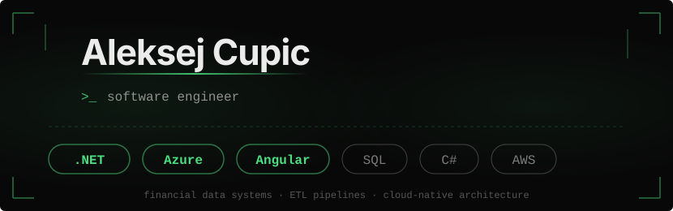

---

## 🔧 Featured Work

### [GEDCOM Genealogy Viewer](https://ged-view.com)
Custom-built GEDCOM file parser and interactive family tree viewer. Features dynamic tree rendering, searchable data grid, profile pages, gallery, calendar, and archival source tools.

`Angular` `TypeScript` `AWS S3` `CloudFront` `Lambda`

### [Options Pricing](https://options-pricing-cupic.streamlit.app/)
LSM and Black-Scholes option pricer with interactive Greeks visualizer.

`Python` `Streamlit`

### Portfolio Valuation Service
Azure-native rewrite of a legacy valuation platform with Excel add-in built on ExcelDNA.

`C#` `.NET` `Azure` `ExcelDNA`

### [EfDataRebuilder](https://aleksejcupic.com) `coming soon`
Reflection-based NuGet package that detects and reconstructs missing versioned records in Entity Framework projects. Automatically identifies gaps caused by versioning strategy changes across multi-table entities and rebuilds the audit trail using timestamp analysis.

`C#` `.NET` `Entity Framework` `Reflection` `NuGet`

### ExcelDNA Add-in
Excel add-in built on EfDataRebuilder with Entra ID authentication and automatic remote updates.

`C#` `.NET` `ExcelDNA` `Entra ID`

### [Home Server Stack](https://github.com/aleksejcupic/home-server-setup)
Docker-based self-hosted infrastructure: AdGuard Home, Paperless-ngx, Portainer, Uptime Kuma, Speedtest Tracker, Plex, Jellyfin. Fully documented and reproducible.

`Docker` `Prometheus` `Grafana` `Linux`

---

## 📊 GitHub Stats

